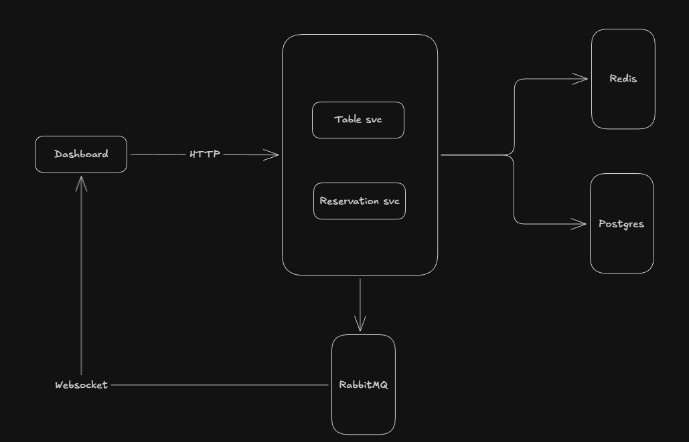

# Restaurant Management System

A microservices-based restaurant management system built with Bun, Express, Vue 3, and PostgreSQL.

## AI Usage

Check [AI_USAGE.md](AI_USAGE.md) for details on how AI was used in the development of this project.

## Unit Test Coverage

Check unit test coverage result in workflow github action [unit-test-coverage](https://github.com/hilmanfjrsy/restaurant-management/actions/workflows/test-coverage.yml)

## System design


## Architecture

```
restauran-management/
├── dashboard/              # Vue 3 frontend application
├── reservation-service/    # Reservation management API
├── table-service/          # Table management API
└── packages/
    ├── db/                 # Shared database layer (Drizzle ORM)
    └── events/             # Shared event system (RabbitMQ)
```

## Tech Stack

- **Runtime**: Bun
- **Frontend**: Vue 3, Vite, Pinia, TanStack Query, Tailwind CSS
- **Backend**: Express 5, TypeScript
- **Database**: PostgreSQL 15, Drizzle ORM
- **Cache**: Redis 7
- **Message Broker**: RabbitMQ 3
- **Testing**: Vitest (dashboard), Jest (services)

## Prerequisites

- [Bun](https://bun.sh/) >= 1.0
- [Docker](https://www.docker.com/) and Docker Compose

## Getting Started

### Running with Docker (Recommended)

Start all services with a single command:

```bash
docker-compose up -d
```

This will start:

| Service             | URL                     |
| ------------------- | ----------------------- |
| Dashboard           | http://localhost:3000   |
| Reservation Service | http://localhost:3001   |
| Table Service       | http://localhost:3002   |
| PostgreSQL          | localhost:5432          |
| Redis               | localhost:6379          |
| RabbitMQ Management | http://localhost:15672  |

To stop all services:

```bash
docker-compose down
```

To stop and remove volumes:

```bash
docker-compose down -v
```

### Running Locally (Development)

1. **Start infrastructure services**:

```bash
docker-compose up -d postgres redis rabbitmq
```

2. **Install dependencies**:

```bash
bun install
```

3. **Run database migrations**:

```bash
cd packages/db
bun run migrate
bun run seed
```

4. **Start services** (in separate terminals):

```bash
# Terminal 1 - Reservation Service
cd reservation-service
bun run dev

# Terminal 2 - Table Service
cd table-service
bun run dev

# Terminal 3 - Dashboard
cd dashboard
bun run dev
```

## Running Tests

Run tests with coverage for each service:

```bash
# Dashboard
cd dashboard
bun run test:coverage

# Reservation Service
cd reservation-service
bun run test:coverage

# Table Service
cd table-service
bun run test:coverage
```

## Environment Variables

### Dashboard

| Variable                       | Default                   | Description                      |
| ------------------------------ | ------------------------- | -------------------------------- |
| `VITE_TABLE_SERVICE_URL`       | http://localhost:4000     | Table service API URL            |
| `VITE_TABLE_SERVICE_API_KEY`   |                           | Table service API key            |
| `VITE_TABLE_SERVICE_WS_URL`    | ws://localhost:4000       | Table service WebSocket URL      |
| `VITE_RESERVATION_SERVICE_URL` | http://localhost:5000     | Reservation service API URL      |
| `VITE_RESERVATION_SERVICE_API_KEY` |                       | Reservation service API key      |

### Reservation Service / Table Service

| Variable            | Default           | Description                    |
| ------------------- | ----------------- | ------------------------------ |
| `PORT`              | 3000              | Service port                   |
| `NODE_ENV`          | development       | Environment mode               |
| `DATABASE_HOST`     | localhost         | PostgreSQL host                |
| `DATABASE_PORT`     | 5432              | PostgreSQL port                |
| `DATABASE_NAME`     | postgres          | Database name                  |
| `DATABASE_USERNAME` | postgres          | Database username              |
| `DATABASE_PASSWORD` | password          | Database password              |
| `DATABASE_USE_SSL`  | false             | Enable SSL for database        |
| `EVENT_HOST`        | localhost         | RabbitMQ host                  |
| `EVENT_PORT`        | 5672              | RabbitMQ port                  |
| `EVENT_USERNAME`    | guest             | RabbitMQ username              |
| `EVENT_PASSWORD`    | guest             | RabbitMQ password              |
| `REDIS_HOST`        | localhost         | Redis host                     |
| `REDIS_PORT`        | 6379              | Redis port                     |
| `REDIS_PASSWORD`    |                   | Redis password                 |
| `API_KEY`           | secret-api-key    | API authentication key         |

## API Endpoints

### Reservation Service (Port 3001)

- `GET /health` - Health check
- `GET /reservations` - List reservations
- `POST /reservations` - Create reservation
- `GET /customers` - List customers
- `POST /customers` - Create customer

### Table Service (Port 3002)

- `GET /health` - Health check
- `GET /tables` - List tables
- `POST /tables` - Create table
- `PATCH /tables/:id` - Update table

## License

MIT
